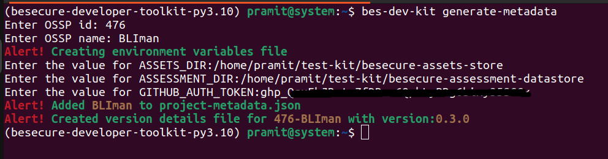
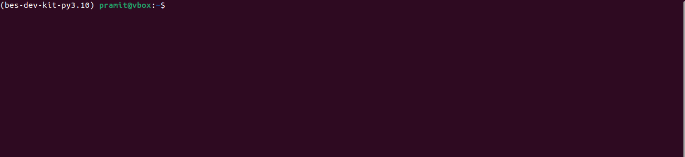

# BeS-dev-kit

BeS-dev-kit is a cli tool for generating metadata and assessment report for [BeSLighthouse](https://github.com/Be-Secure/BeSLighthouse).

# Pre-requisites

1. Python 3.10
2. pip
3. Github personal access token

# Installation

`$ python3 -m pip install bes-dev-kit`

# Usage

If you are running the command for the first time, you will be prompted to provide the complete path to your `besecure-osspoi-datastore` and `besecure-assessment-datastore` and your `personal access token`

### Generate Metadata

Command helps to generate metadata such as OSSP-master file data and version details file.

`$ bes-dev-kit generate-metadata`

For more options use `--help` at end.

`Note: For the first time use this command will ask for three extra inputs - OSSPOI_DIR: location of besecure-osspoi-datastore in local system, ASSESSMENT_DIR: location of besecure-assessment-datastore, GITHUB_AUTH_TOKEN`

### Generate Reports

`$ bes-dev-kit generate-report` -  generate all reports (scorecard, sciticality_score, codeql, sbom)

`$ bes-dev-kit generate-report < report name > ... < report name >` - generate specific report

`<report name> - scorecard, codeql, criticality_score`

For more options use `--help` at end.

`Note: All three reports can be generated at once by passing all report names - $ bes-dev-kit generate report scorecard criticality_score codeql`

### Download Risk Summary

Command helps to download risk-summary of Be-Secure listed open source projects in PDF format.

`$ bes-dev-kit risk-summary`

For more options use `--help` at end.

### Validate Version Details file

`$ bes-dev-kit validate-version-file`

Command helps to check version details file naming convention.

For more details use `--help` at end.

### Validate Report files

Command helps to check report files naming convention / if report file available.

`$ bes-dev-kit validate-report-file <report name> ... <report name>`

`Note: Provide listed parameters only. scorecard, codeql, criticality_score, sonarqube, sbom, fossology`

Use bellow command to check all reports at a time.

`$ bes-dev-kit validate-report-file`

For more details use `--help` at end.

# Setting up locally

1. Install [poetry](https://python-poetry.org/). Use the [link](https://python-poetry.org/docs/) to install Poetry.
2. Clone the repo.
3. Move into the cloned directory.
4. Run the command - `$ poetry add "typer[all]"`
5. Create a new virtual env using Poetry - `$ poetry shell`
6. Run the command to install the tool- `$ poetry install`
7. Check installation - `$ bes-dev-kit --help`

